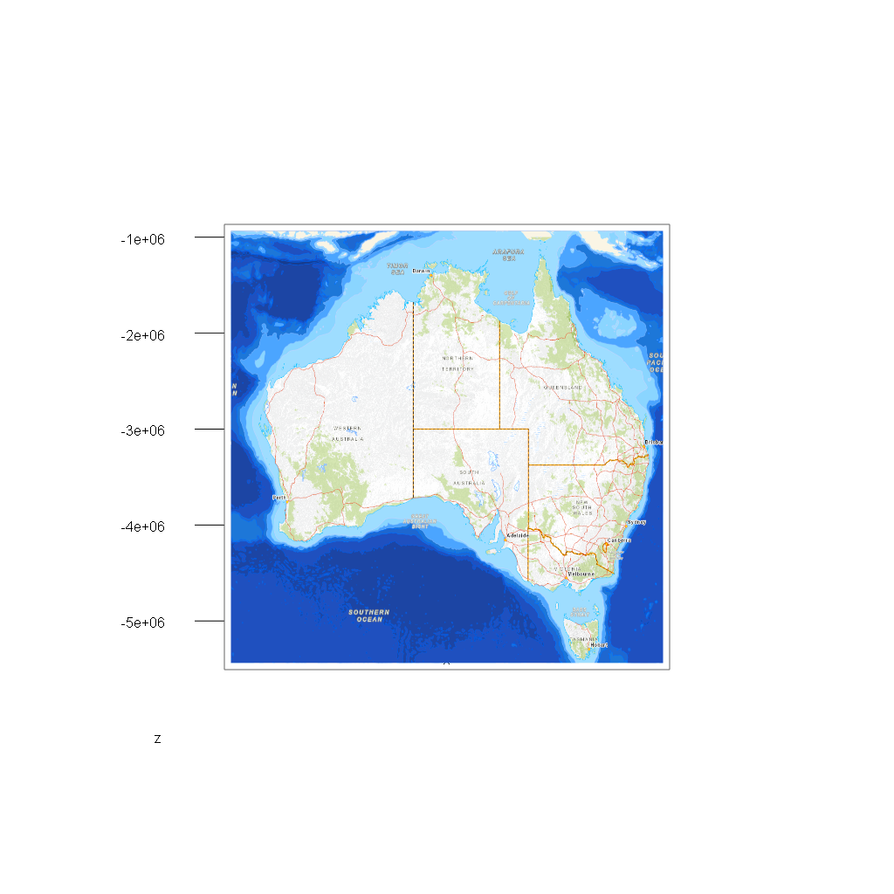
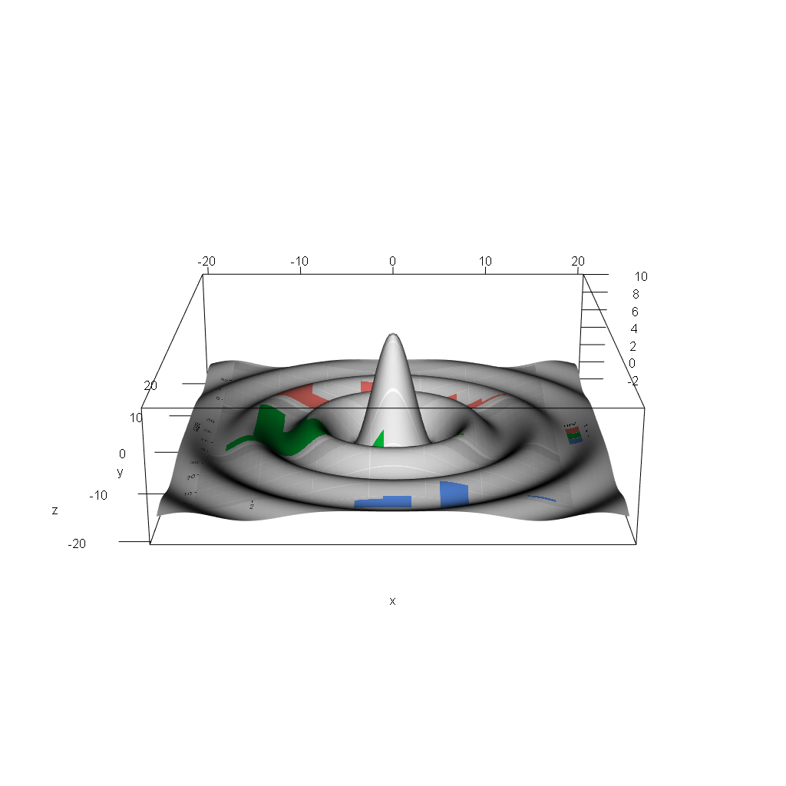

<!-- README.md is generated from README.Rmd. Please edit that file -->

```{r, include = FALSE}
knitr::opts_chunk$set(
  collapse = TRUE,
  comment = "#>",
  fig.path = "man/figures/README-",
  out.width = "100%"
)
```

# textures

<!-- badges: start -->
[](https://github.com/hypertidy/textures/actions)
<!-- badges: end -->


The goal of textures is to utilize texture mapping in rgl to work with images in different coordinate systems and mapped onto arbitrary shapes. 

There's a couple of functions in the package, with ongoing work to explore examples and align them 
to package functionality. 

The goal is for this package to illustrate texture mapping capability in rgl with *core techniques familiar to R users*, and with minimal *resort to specialist code*. When specialist code is required
it will be brought out explicitly and explained in a single-step. 


Very WIP

## Installation

Only for dev interest. 

```R
## install.packages("remotes")
remotes::install_github("hypertidy/textures")
```


## Example

A Mercator raster on a single quad. Zoom in and out but no translate or pivot (it's disabled). 

Maps an image onto a quad from a PNG file. Run this code and zoom in and out. 


```{r example, eval = FALSE}
library(textures)
## create a temporary file and write an image to it
tfile <- tempfile(fileext = ".png")
png::writePNG(ga_topo$img/255, tfile)

## create a quad *canvas*, a single 4-corner shape floating in 3D
## (and use the PNG file as the material to texture that canvas)
quad0 <- quad(texfile = tfile)

## set the geography of the canvas, this is trivial because we have a rectangular
## scale that applies directly as a scaling of x and y
quad0$vb[1L,] <- scales::rescale(quad0$vb[1,], to = ga_topo$extent[c("xmin", "xmax")])
quad0$vb[2L,] <- scales::rescale(quad0$vb[2L,], to = ga_topo$extent[c("ymin", "ymax")])

## plot it in 3D 
rgl::open3d()
rgl::plot3d(quad0, specular = "black")
set_scene()  ## this sets the plot up to appear like a 2D image

```


```{r example-1, include = FALSE, eval=FALSE}
## *NOTE: can't run this in rmarkdown or snapshot doesn't work.*

## take a snapshot to appear in this README, see below
dir.create("man/figures", showWarnings = FALSE)
rgl::rgl.bringtotop()
rgl::snapshot3d("man/figures/readme_ga000.png")
```





Maps are fun but R is not just about *geography*. 


```{r example--gg, eval = FALSE, include = TRUE}
library(ggplot2)
library(rgl)
## create a plot and save it
g <- ggplot(mpg, aes(displ, fill = drv)) + 
  geom_histogram(binwidth = 0.5) + 
  facet_wrap(~drv, ncol = 1)
tfile <- tempfile(fileext = ".png")
ggsave(tfile, g)


library(textures)
quad0 <- quad(texfile = tfile, depth = 7)

ex <- -20
## flip it (fixme later)
quad0$vb[1L, ] <- 1-quad0$vb[1L, ]
quad0$vb[2L, ] <- 1-quad0$vb[2L, ]

quad0$vb[1L,] <- scales::rescale(quad0$vb[1,], to = c(-1, 1) * ex)
quad0$vb[2L,] <- scales::rescale(quad0$vb[2L,], to = c(-1, 1) * ex)

f <- function(x, y) { r <- sqrt(x^2+y^2); 10 * sin(r)/r }  ## ?persp
quad0$vb[3L, ] <- f(quad0$vb[1L,], quad0$vb[2L,])

quad0 <- addNormals(quad0)  ## we are still in rgl scope, so everything is available
## plot it in 3D 
rgl::open3d()
rgl::plot3d(quad0, specular = "black")
rgl::aspect3d(1, 1, .3)
#set_scene(phi = 15, interactive = TRUE)
par3d(windowRect  = c(0, 0, 1024, 1024))

```


```{r example-gg1, include = FALSE, eval=FALSE}
## *NOTE: can't run this in rmarkdown or snapshot doesn't work.*

## take a snapshot to appear in this README, see below
dir.create("man/figures", showWarnings = FALSE)
rgl::rgl.bringtotop()
rgl::snapshot3d("man/figures/readme_gg000.png")
```




## Re-map projections


*see ./rough-examples.R* WIP

* **rough-examples#1**: See Mercator map above. 
* **rough-examples#2.**: Illustrate folly of low-density primitives for reprojection
* **rough-examples#3.**: Create a generalized surface in arbitrary map projection and remap the image losslessly
* **rough-examples#4.**: Explore the use of primitive shapes for placing image fragments arbitrarily


---

## Code of Conduct

Please note that the textures project is released with a [Contributor Code of Conduct](https://contributor-covenant.org/version/2/0/CODE_OF_CONDUCT.html). By contributing to this project, you agree to abide by its terms.

