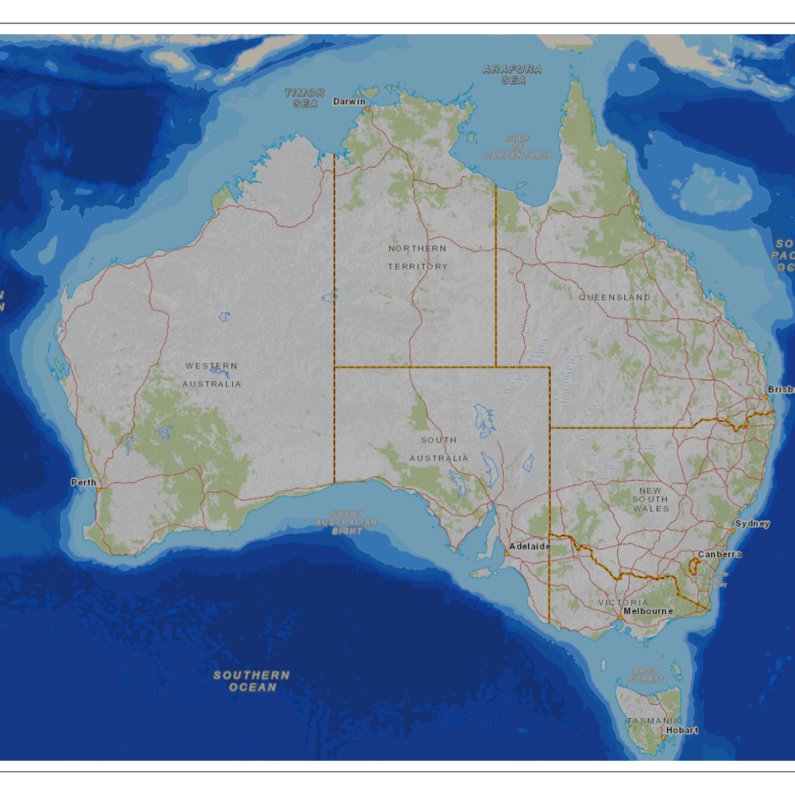
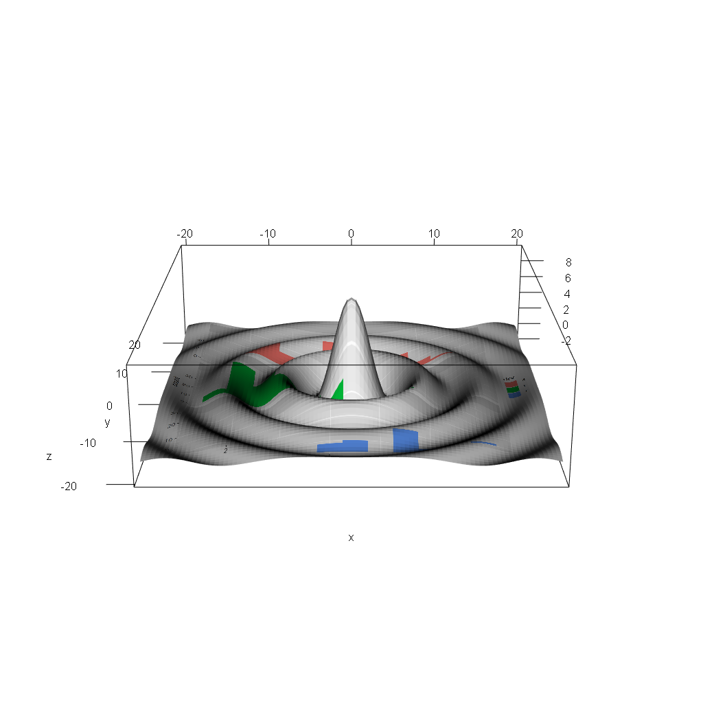

<!-- README.md is generated from README.Rmd. Please edit that file -->

# textures

<!-- badges: start -->

[](https://github.com/hypertidy/textures/actions)
<!-- badges: end -->

The goal of textures is to utilize texture mapping in rgl to work with
images in different coordinate systems and mapped onto arbitrary shapes.

We aim to illustrate texture mapping capability in rgl with *core
techniques familiar to R users*, and with minimal *resort to specialist
code*. When specialist code is required it will be brought out
explicitly and explained in a single-step.

## Design

Current functions are:

-   **png\_plot3d()** - plots a PNG file in a 3D scene
-   **quad()** create a simple mesh3d object with 1 or more quad
    primitives
-   **quad\_texture()** create a mesh3d object with 1 or more quads, and
    the texture coordinates and file path to a PNG file
-   **set\_scene()** a convenience wrapper to rgl scene settings, it
    makes the scene look “straight-down” and locks pan and tilt so the
    rgl device like a zoom-in/zoom-out 2D displaye
-   **break\_mesh()** break the topology of a mesh (so that primitives
    can be free-floating, not tied to their neighbour’s vertices)

See [design
vignette](https://github.com/hypertidy/textures/blob/master/vignettes/design.Rmd).

## Installation

Install from github, will require development tools for compiling code.

``` r
## install.packages("remotes")
remotes::install_github("hypertidy/textures")
```

## Example

A Mercator raster on a single quad. Zoom in and out but no translate or
pivot.

Maps an image onto a quad from a PNG file. Run this code and zoom in and
out.

``` r
library(textures)
## create a temporary file and write an image to it
tfile <- tempfile(fileext = ".png")
png::writePNG(ga_topo$img/255, tfile)

## create a quad *canvas*, a single 4-corner shape floating in 3D
## (and use the PNG file as the material to texture that canvas)
quad0 <- quad_texture(c(1, 1), texture = tfile)

## set the geography of the canvas, this is trivial because we have a rectangular
## scale that applies directly as a scaling of x and y
quad0$vb[1L,] <- scales::rescale(quad0$vb[1,], to = ga_topo$extent[c("xmin", "xmax")])
quad0$vb[2L,] <- scales::rescale(quad0$vb[2L,], to = ga_topo$extent[c("ymin", "ymax")])

## plot it in 3D 
rgl::open3d()
rgl::plot3d(quad0, specular = "black")
set_scene()  ## this sets the plot up to appear like a 2D image
```



Maps are fun but R is not just about *geography*.

``` r
library(ggplot2)
library(rgl)
## create a plot and save it
g <- ggplot(mpg, aes(displ, fill = drv)) + 
  geom_histogram(binwidth = 0.5) + 
  facet_wrap(~drv, ncol = 1)
tfile <- tempfile(fileext = ".png")
ggsave(tfile, g)


library(textures)
quad0 <- quad_texture(dim = c(92, 102), texture = tfile)

ex <- -20
## flip it (fixme later)
quad0$vb[1L, ] <- 1-quad0$vb[1L, ]
quad0$vb[2L, ] <- 1-quad0$vb[2L, ]

quad0$vb[1L,] <- scales::rescale(quad0$vb[1,], to = c(-1, 1) * ex)
quad0$vb[2L,] <- scales::rescale(quad0$vb[2L,], to = c(-1, 1) * ex)

f <- function(x, y) { r <- sqrt(x^2+y^2); 10 * sin(r)/r }  ## ?persp
quad0$vb[3L, ] <- f(quad0$vb[1L,], quad0$vb[2L,])

## not working atm ...
#quad0 <- addNormals(quad0)  ## we are still in rgl scope, so everything is available
## plot it in 3D 
rgl::open3d()
rgl::plot3d(quad0, specular = "black")
rgl::aspect3d(1, 1, .3)
#set_scene(phi = 15, interactive = TRUE)
par3d(windowRect  = c(0, 0, 1024, 1024))
```



## Re-map projections

*see ./rough-examples.R* WIP

-   **rough-examples\#1**: See Mercator map above.
-   **rough-examples\#2.**: Illustrate folly of low-density primitives
    for reprojection
-   **rough-examples\#3.**: Create a generalized surface in arbitrary
    map projection and remap the image losslessly
-   **rough-examples\#4.**: Explore the use of primitive shapes for
    placing image fragments arbitrarily

------------------------------------------------------------------------

## Code of Conduct

Please note that the textures project is released with a [Contributor
Code of
Conduct](https://contributor-covenant.org/version/2/0/CODE_OF_CONDUCT.html).
By contributing to this project, you agree to abide by its terms.
